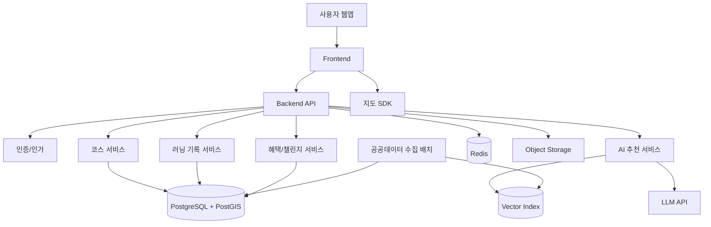

# 기술 설계서: 뛴데이(뛴DAY) 웹앱

## 1. 설계 목표

뛴데이는 부산 공공데이터, 지도 데이터, 사용자 운동 기록, AI 추천 엔진을 결합해 개인 맞춤형 러닝·산책 경험을 제공하는 웹앱입니다. 기술 설계의 핵심 목표는 다음과 같습니다.

- 공공데이터 기반 코스 추천의 신뢰성 확보
- 모바일 웹 중심의 빠른 지도 경험 제공
- 위치정보와 운동 기록의 안전한 수집 및 저장
- AI 추천, 드로잉런, 실시간 코칭 기능을 단계적으로 확장 가능한 구조로 설계
- 지역 상권, ESG 챌린지, 정책 연계 기능을 플러그인처럼 추가 가능한 도메인 구조 확보

## 2. 권장 아키텍처



## 3. 기술 스택

| 영역 | 권장 기술 |
| --- | --- |
| Frontend | Next.js, React, TypeScript |
| Styling | Tailwind CSS 또는 CSS Modules |
| Map | Kakao Maps, Naver Maps, Mapbox, Leaflet 중 택1 |
| Backend | Next.js API Routes 또는 NestJS |
| Database | PostgreSQL + PostGIS |
| Cache | Redis |
| AI | LLM API, RAG, Embedding, 추천 스코어링 |
| Storage | S3 호환 객체 스토리지 |
| Batch | Node.js Cron, BullMQ, 또는 서버리스 스케줄러 |
| Monitoring | Sentry, OpenTelemetry, Cloud 로그 |
| Deployment | Vercel, AWS, Naver Cloud, Azure 중 택1 |

## 4. 도메인 모델

### 4.1 User

| 필드 | 설명 |
| --- | --- |
| id | 사용자 ID |
| email | 이메일 |
| nickname | 닉네임 |
| birthYear | 출생연도 선택값 |
| fitnessLevel | 초보, 보통, 숙련 |
| preferredDistance | 선호 거리 |
| preferredEnvironments | 공원, 해변, 하천, 도심, 조용한 길 등 |
| createdAt | 가입일 |

### 4.2 PetProfile

| 필드 | 설명 |
| --- | --- |
| id | 반려견 프로필 ID |
| userId | 사용자 ID |
| name | 이름 |
| breed | 견종 |
| age | 나이 |
| weight | 체중 |
| walkFrequency | 산책 빈도 |
| healthMemo | 건강 참고 메모 |

### 4.3 Course

| 필드 | 설명 |
| --- | --- |
| id | 코스 ID |
| title | 코스명 |
| region | 지역 |
| type | 러닝, 산책, 관광, 드로잉런, 반려견, 플로깅 |
| distanceMeters | 거리 |
| expectedMinutes | 예상 소요 시간 |
| difficulty | 난이도 |
| routeGeometry | PostGIS LineString |
| startPoint | 시작 좌표 |
| endPoint | 종료 좌표 |
| safetyScore | 안전성 점수 |
| amenityScore | 편의성 점수 |
| source | 데이터 출처 |
| isPublicDataBased | 공공데이터 기반 여부 |

### 4.4 Facility

| 필드 | 설명 |
| --- | --- |
| id | 시설 ID |
| name | 시설명 |
| type | 공원, 화장실, 운동기구, 공공시설, 반려동물 동반 가능 장소 |
| location | 좌표 |
| address | 주소 |
| openingHours | 운영시간 |
| isPaid | 유료 여부 |
| source | 출처 |
| lastSyncedAt | 동기화 일시 |

### 4.5 RunSession

| 필드 | 설명 |
| --- | --- |
| id | 운동 기록 ID |
| userId | 사용자 ID |
| courseId | 코스 ID |
| startedAt | 시작 시간 |
| endedAt | 종료 시간 |
| distanceMeters | 실제 거리 |
| durationSeconds | 실제 시간 |
| averagePace | 평균 페이스 |
| routeGeometry | 실제 이동 경로 |
| completionStatus | 완료, 중단, 이탈 |
| carbonSavedGrams | 탄소 절감량 |

### 4.6 Challenge

| 필드 | 설명 |
| --- | --- |
| id | 챌린지 ID |
| title | 챌린지명 |
| type | 플로깅, 배리어프리, 관광, 완주 |
| region | 지역 |
| targetCondition | 달성 조건 |
| rewardPolicy | 보상 정책 |
| startsAt | 시작일 |
| endsAt | 종료일 |

## 5. 데이터 파이프라인

1. 공공데이터 API 또는 파일을 주기적으로 수집합니다.
2. 주소, 좌표, 시설 유형, 운영시간, 출처를 표준 스키마로 정규화합니다.
3. 좌표계를 WGS84 기준으로 통일합니다.
4. PostGIS에 시설, 공원, 코스 후보 데이터를 저장합니다.
5. 추천 검색에 필요한 텍스트 설명을 생성해 벡터 인덱스에 저장합니다.
6. 데이터 기준일과 출처를 저장해 사용자에게 표시할 수 있게 합니다.

## 6. AI 추천 설계

### 6.1 자연어 조건 추출

사용자 입력 예시:

```text
오늘 밤 30분 정도 반려견과 조용하게 산책할 수 있는 코스 추천해줘
```

추출 스키마:

```json
{
  "activityType": "walk",
  "durationMinutes": 30,
  "distanceMeters": null,
  "intensity": "low",
  "timePreference": "night",
  "environmentPreference": ["quiet"],
  "withPet": true,
  "region": null
}
```

### 6.2 추천 점수

추천 점수는 다음 요소를 가중합으로 계산합니다.

- 거리/시간 적합도
- 사용자 체력 수준 적합도
- 현재 위치 접근성
- 공원·녹지·보행로 비율
- 편의시설 접근성
- 반려견 동반 가능성
- 야간 안전성
- 과거 완주율
- 사용자 선호도
- 지역 활성화 또는 관광 가치

### 6.3 RAG 구조

- 공공데이터, 코스 설명, 시설 정보, 지역 설명을 문서화합니다.
- Embedding으로 벡터 인덱스를 구축합니다.
- 자연어 요청 조건과 유사한 코스/시설을 검색합니다.
- LLM은 검색된 데이터만 근거로 추천 사유를 생성합니다.
- 응답에는 추천 근거와 데이터 출처를 포함합니다.

### 6.4 안전장치

- 실제 경로가 없는 도안은 추천하지 않습니다.
- 지나치게 긴 거리 또는 사용자 수준에 맞지 않는 코스는 경고합니다.
- 야간 코스는 조명, 공공시설, 접근성 정보가 부족하면 낮은 점수를 부여합니다.
- AI 실패 시 규칙 기반 추천으로 대체합니다.

## 7. 드로잉런 설계

MVP에서는 미리 정의한 도안 템플릿을 사용합니다.

1. 사용자가 거리와 도안 유형을 선택합니다.
2. 현재 위치 주변 후보 영역을 계산합니다.
3. 도안 템플릿을 후보 영역에 맞게 스케일링합니다.
4. 지도 API 또는 보행로 데이터에 경로를 스냅합니다.
5. 거리 오차율, 교차로 수, 보행 가능성, 편의시설 접근성을 평가합니다.
6. 상위 4~5개 후보를 표시합니다.

고도화 단계에서는 도로망 그래프 기반 경로 탐색과 형태 유사도 최적화를 적용합니다.

## 8. 주요 API 설계

### 8.1 코스

| Method | Path | 설명 |
| --- | --- | --- |
| GET | /api/courses | 코스 목록 조회 |
| GET | /api/courses/:id | 코스 상세 조회 |
| GET | /api/facilities | 주변 시설 조회 |
| POST | /api/courses/recommend | 조건 기반 코스 추천 |
| POST | /api/courses/ai-recommend | 자연어 기반 AI 추천 |
| POST | /api/courses/drawing-run | 드로잉런 후보 생성 |

### 8.2 러닝 기록

| Method | Path | 설명 |
| --- | --- | --- |
| POST | /api/runs | 러닝 시작 |
| PATCH | /api/runs/:id | 러닝 상태 업데이트 |
| POST | /api/runs/:id/finish | 러닝 종료 |
| GET | /api/runs/:id | 기록 상세 조회 |
| GET | /api/users/me/runs | 내 기록 목록 |

### 8.3 챌린지/혜택

| Method | Path | 설명 |
| --- | --- | --- |
| GET | /api/challenges | 챌린지 목록 |
| POST | /api/challenges/:id/submit | 챌린지 인증 |
| GET | /api/rewards | 주변 혜택 목록 |
| POST | /api/rewards/:id/redeem | 혜택 사용 |

## 9. 프론트엔드 화면 구조

- 홈 지도 화면
- AI 추천 입력 패널
- 코스 목록 바텀시트
- 코스 상세 화면
- 드로잉런 생성 화면
- 러닝 진행 화면
- 운동 결과 화면
- 내 기록 화면
- 반려견 프로필 화면
- 챌린지 화면
- 혜택 화면
- 관리자 화면

## 10. 위치정보/개인정보 설계

- 위치 권한은 기능 사용 시점에 요청합니다.
- 실시간 위치는 러닝 중에만 수집합니다.
- 정밀 위치 기록은 사용자가 삭제할 수 있어야 합니다.
- 건강 상태 입력은 선택값으로 제공합니다.
- 반려견 정보는 추천 목적 외 사용을 제한합니다.
- 로그, 분석 이벤트, AI 프롬프트에 개인정보가 남지 않도록 마스킹합니다.

## 11. 성능 설계

- 지도 마커는 줌 레벨과 화면 영역 기준으로 서버에서 페이징합니다.
- 공공시설 조회는 공간 인덱스를 사용합니다.
- 자주 조회되는 지역 코스는 Redis에 캐싱합니다.
- AI 추천은 비동기 처리와 타임아웃을 적용합니다.
- 위치 업데이트는 일정 거리 이상 이동하거나 일정 시간 경과 시 전송합니다.

## 12. 배포/운영

- 개발, 스테이징, 운영 환경을 분리합니다.
- DB 마이그레이션은 배포 파이프라인에서 관리합니다.
- 공공데이터 동기화 실패를 관리자에게 알립니다.
- AI 추천 실패율, 응답 시간, 사용자 만족도를 모니터링합니다.
- 지도 API 사용량과 비용을 추적합니다.
- 위치정보 접근 로그를 별도로 관리합니다.

## 13. 단계별 구현 계획

| 단계 | 구현 내용 |
| --- | --- |
| 1단계 | 지도, 공공데이터, 기본 코스, 시설 표시 |
| 2단계 | 조건 기반 추천, 코스 상세, 기록 저장, 완주 인증 |
| 3단계 | AI 자연어 추천, RAG, 운동 후 피드백 |
| 4단계 | 드로잉런 생성, 실시간 코칭, 반려견 추천 |
| 5단계 | 지역 혜택, 챌린지, 관리자, 수익화 기능 |
